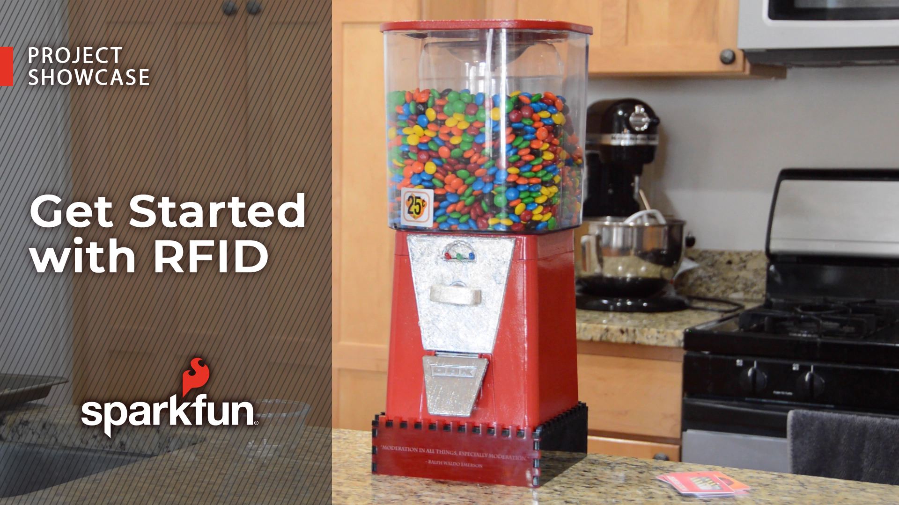

# SparkFun RFID Gumball Machine

This is a fairly straightforward (yet cool enough to amaze your friends) project I put together to demonstrate the [SparkFun RFID Qwiic Kit](https://www.sparkfun.com/products/15209). It works as follows:
Each member of my family has their own [RFID card](https://www.sparkfun.com/products/14325). When we pass our card past the reader in the candy machine, the reader detects whose card it is, as well of the number of servings they've had that day. If it is more than two servings, they get flashing red and blue lights instead of delicious candy treats. I'm using the [SparkFun Real Time Clock Module - RV-8803](https://www.sparkfun.com/products/16281) to keep track of the days. As each day rolls over to the next, the serving numbers are reset to zero. A [Generic High Torque Continuous Rotation Servo](https://www.sparkfun.com/products/93470) dispenses the candy.
